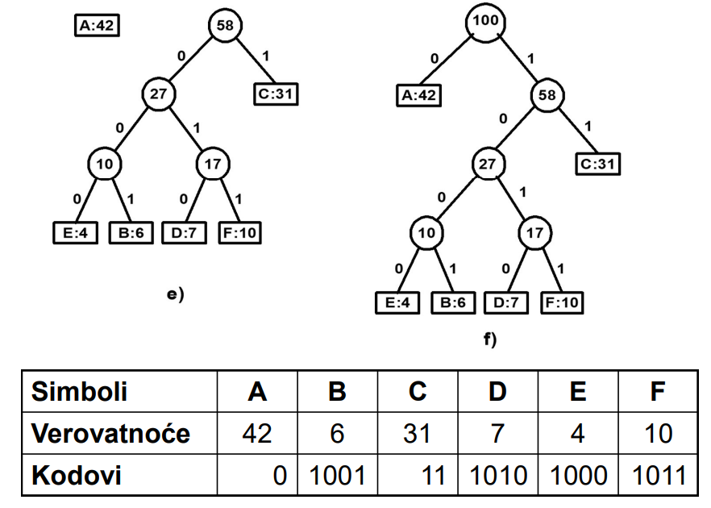

# Huffman Coding Compression Tool

## Overview

This project implements the Huffman coding algorithm, a method for lossless data compression. The program builds a binary tree based on the frequency of characters in a given message, assigns binary codes to each character, and encodes/decodes messages using the Huffman tree.
Note that the the encoded message is a string itself and not binary code as this project is for demonstration purposes.

## Features

- **Message Encoding**: Compress a message by assigning binary codes to characters based on their frequency in the message.
- **Message Decoding**: Decompress the encoded message back to its original form.
- **Interactive Menu**: The program allows users to encode and decode messages interactively.
- **Huffman Tree Visualization**: A visual representation of the Huffman tree is provided in `huffman.png`.

## How It Works

1. **Frequency Calculation**: The program calculates the frequency of each character in the input message.
2. **Huffman Tree Construction**: Based on character frequencies, a binary tree is built, where the most frequent characters are assigned shorter binary codes.
3. **Encoding**: Each character is replaced with its corresponding binary code.
4. **Decoding**: The binary code is translated back to the original message using the Huffman tree.



## File Descriptions

- **huffman.cpp**: Contains the implementation of the Huffman tree, the encoding, and decoding algorithms.
- **huffman.h**: Header file defining the `Node` struct and function prototypes.
- **main.cpp**: Provides the interactive menu for encoding and decoding messages.
- **huffman.png**: Visual representation of a Huffman tree built for an example message.

## Key Functions

- **`createTree()`**: Builds the Huffman tree from character frequencies.
- **`generateCodes()`**: Generates the binary Huffman codes for each character by traversing the tree.
- **`encode()`**: Encodes the input message into a compressed binary string.
- **`decode()`**: Decodes a binary string back into the original message using the Huffman tree.

## How to Use

1. **Compile the Program**:
   ```bash
   g++ main.cpp huffman.cpp -o huffman_tool
   ```
1. **Run the Program**:
   ```bash
   ./huffman_tool
   ```
